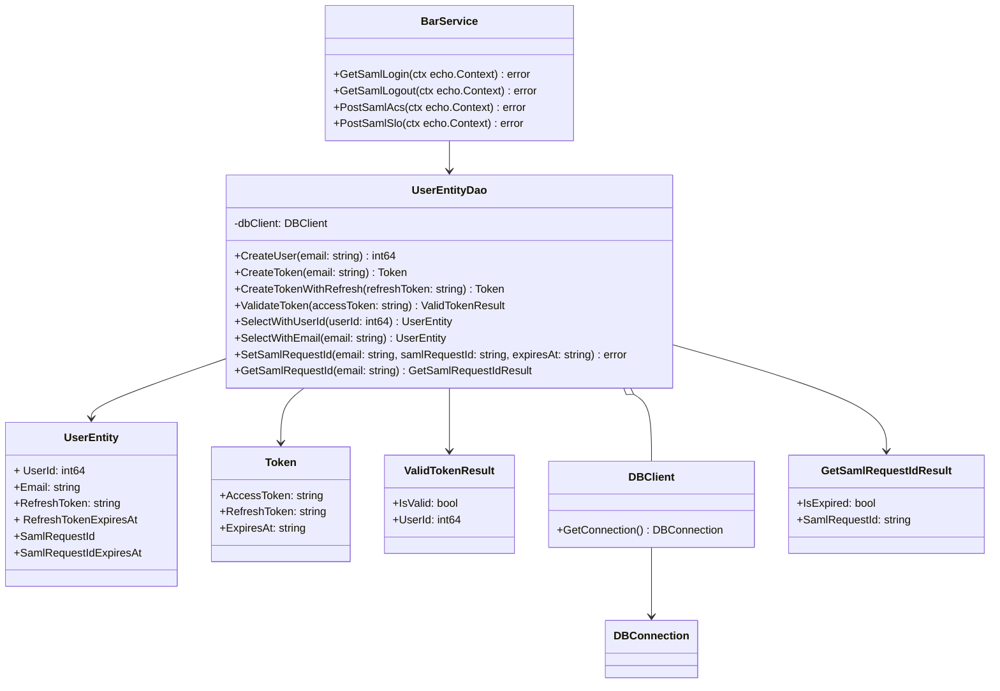

```mermaid
classDiagram
  direction TB
  class UserEntity {
    + UserId#58; int64
    +Email#58; string
    +RefreshToken#58; string
    +      RefreshTokenExpiresAt
    +SamlRequestId
    +SamlRequestIdExpiresAt
  }
  class UserEntityDao {
    -dbClient#58; DBClient
    +CreateUser(email#58; string) int64
    +CreateToken(email#58; string) Token
    +CreateTokenWithRefresh(refreshToken#58; string) Token
    +ValidateToken(accessToken#58; string) ValidTokenResult
    +SelectWithUserId(userId#58; int64) UserEntity
    +SelectWithEmail(email#58; string) UserEntity
    +SetSamlRequestId(email#58; string, samlRequestId#58; string, expiresAt#58; string) error
    +GetSamlRequestId(email#58; string) GetSamlRequestIdResult
  }
  class Token {
    +AccessToken#58; string
    +RefreshToken#58; string
    +ExpiresAt#58; string
  }
  class ValidTokenResult {
    +IsValid#58; bool
    +UserId#58; int64
  }
  class DBClient {
    +GetConnection() DBConnection
  }
  class DBConnection {
  }
  class BarService {
    +GetSamlLogin(ctx echo.Context) error
    +GetSamlLogout(ctx echo.Context) error
    +PostSamlAcs(ctx echo.Context) error
    +PostSamlSlo(ctx echo.Context) error
  }
  class GetSamlRequestIdResult {
    +IsExpired#58; bool
    +SamlRequestId#58; string
  }
  UserEntityDao --> UserEntity
  UserEntityDao --> Token
  UserEntityDao --> ValidTokenResult
  DBClient --> DBConnection
  UserEntityDao o-- DBClient
  BarService --> UserEntityDao
  UserEntityDao --> GetSamlRequestIdResult
```