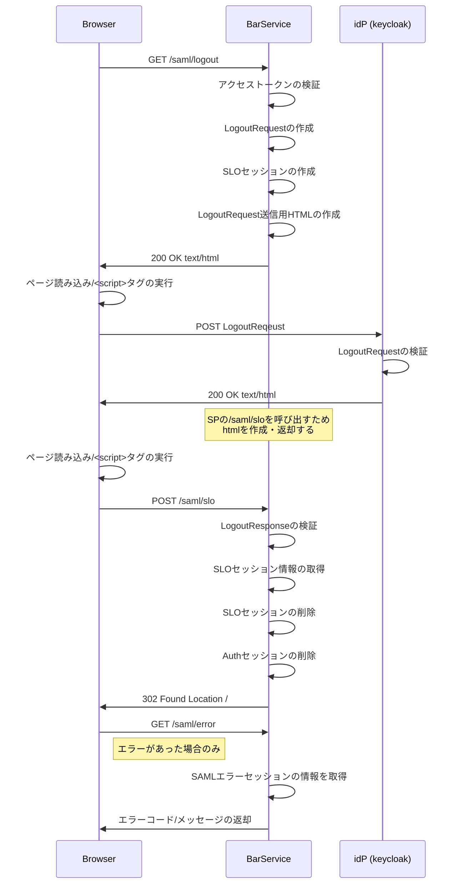

```mermaid
sequenceDiagram
  participant line_1 as Browser
  participant line_2 as BarService
  participant line_3 as idP (keycloak)
  line_1 ->> line_2: GET /saml/logout
  line_2 ->> line_2: アクセストークンの検証
  line_2 ->> line_2: LogoutRequestの作成
  line_2 ->> line_2: SLOセッションの作成
  line_2 ->> line_2: LogoutRequest送信用HTMLの作成
  line_2 ->> line_1: 200 OK text/html
  line_1 ->> line_1: ページ読み込み/<script>タグの実行
  line_1 ->> line_3: POST LogoutReqeust
  line_3 ->> line_3: LogoutRequestの検証
  line_3 ->> line_1: 200 OK text/html
  Note over line_2, line_2: SPの/saml/sloを呼び出すため<br>htmlを作成・返却する
  line_1 ->> line_1: ページ読み込み/<script>タグの実行
  line_1 ->> line_2: POST /saml/slo
  line_2 ->> line_2: LogoutResponseの検証
  line_2 ->> line_2: SLOセッション情報の取得
  line_2 ->> line_2: SLOセッションの削除
  line_2 ->> line_2: Authセッションの削除
  line_2 ->> line_1: 302 Found Location /
  line_1 ->> line_2: GET /saml/error
  Note right of line_1: エラーがあった場合のみ
  line_2 ->> line_2: SAMLエラーセッションの情報を取得
  line_2 ->> line_1: エラーコード/メッセージの返却
```