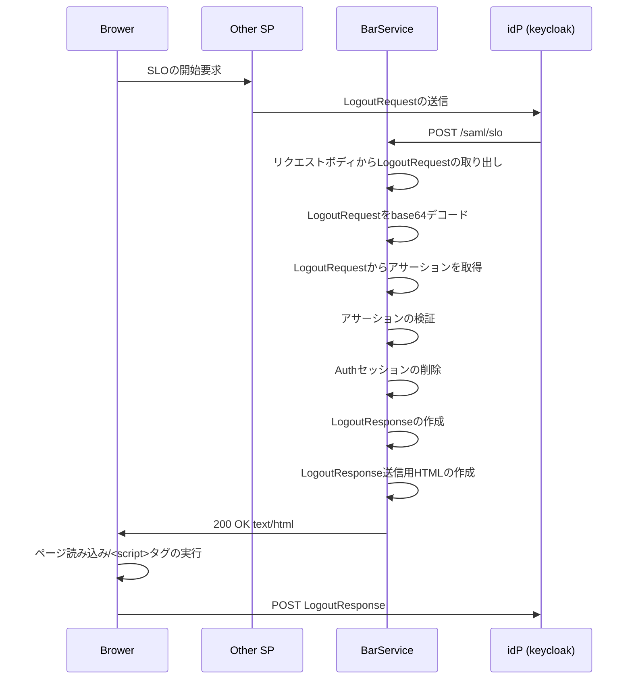

```mermaid
sequenceDiagram
  participant line_4 as Brower
  participant line_1 as Other SP
  participant line_2 as BarService
  participant line_3 as idP (keycloak)
  line_4 ->> line_1: SLOの開始要求
  line_1 ->> line_3: LogoutRequestの送信
  line_3 ->> line_2: POST /saml/slo
  line_2 ->> line_2: リクエストボディからLogoutRequestの取り出し
  line_2 ->> line_2: LogoutRequestをbase64デコード
  line_2 ->> line_2: LogoutRequestからアサーションを取得
  line_2 ->> line_2: アサーションの検証
  line_2 ->> line_2: Authセッションの削除
  line_2 ->> line_2: LogoutResponseの作成
  line_2 ->> line_2: LogoutResponse送信用HTMLの作成
  line_2 ->> line_4: 200 OK text/html
  line_4 ->> line_4: ページ読み込み/<script>タグの実行
  line_4 ->> line_3: POST LogoutResponse
```