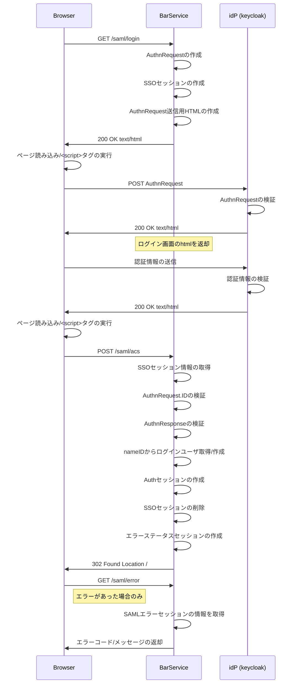

```mermaid
sequenceDiagram
  participant line_1 as Browser
  participant line_2 as BarService
  participant line_3 as idP (keycloak)
  line_1 ->> line_2: GET /saml/login
  line_2 ->> line_2: AuthnRequestの作成
  line_2 ->> line_2: SSOセッションの作成
  line_2 ->> line_2: AuthnRequest送信用HTMLの作成
  line_2 ->> line_1: 200 OK text/html
  line_1 ->> line_1: ページ読み込み/<script>タグの実行
  line_1 ->> line_3: POST AuthnRequest
  line_3 ->> line_3: AuthnRequestの検証
  line_3 ->> line_1: 200 OK text/html
  Note over line_2, line_2: ログイン画面のhtmlを返却
  line_1 ->> line_3: 認証情報の送信
  line_3 ->> line_3: 認証情報の検証
  line_3 ->> line_1: 200 OK text/html
  line_1 ->> line_1: ページ読み込み/<script>タグの実行
  line_1 ->> line_2: POST /saml/acs
  line_2 ->> line_2: SSOセッション情報の取得
  line_2 ->> line_2: AuthnRequest.IDの検証
  line_2 ->> line_2: AuthnResponseの検証
  line_2 ->> line_2: nameIDからログインユーザ取得/作成
  line_2 ->> line_2: Authセッションの作成
  line_2 ->> line_2: SSOセッションの削除
  line_2 ->> line_2: エラーステータスセッションの作成
  line_2 ->> line_1: 302 Found Location /
  line_1 ->> line_2: GET /saml/error
  Note right of line_1: エラーがあった場合のみ
  line_2 ->> line_2: SAMLエラーセッションの情報を取得
  line_2 ->> line_1: エラーコード/メッセージの返却
```